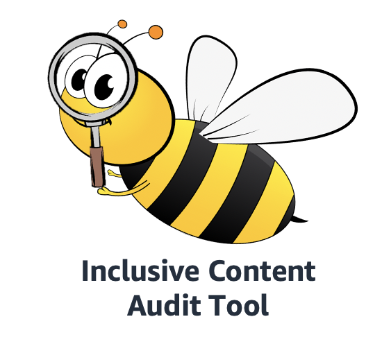

# Inclusive Content Audit Tool 

## 1. Project Overview

This repository provides the resources and instructions required to create your own version of the inclusive content audit tool (ICAT).
ICAT uses AWS textract to scan through your documents uploaded to S3 and highlights potentially offensive words for your reconsideration. A findings report is also generated and appended to the end of your document. 

## 2. Project Abstract

ICAT helps to promote inclusive content in both internal and client-facing documentations by providing a fuss-free mechanism to scan through your documents uploaded to S3. A findings report is appended to the end of the document which highlights the words flagged, the number of words flagged, as well as proposed alternatives for the flagged words. 

## 3. User Experience

The ICAT demo allows the user to upload a document (currently supports both pdf and docx file formats) into a sub-folder inside a S3 bucket named *input*. In a couple of seconds, the user can retrieve their scanned document with a findings report appended to the back, in the other sub-folder under the same directory named *output*. The user can interact with ICAT either using the AWS Management Console or through the Command Line Interface (CLI). 

### 3.1 AWS Management Console
### Video Demo 

### Step-by-step instructions
1. The root S3 bucket “inclusive-content-audit-tool” should contain two sub folders - “input” and “output”.

2. Navigate into the “input” folder. The folder should be empty on first access. 

3. Upload the document to be evaluated into the folder.

4. The uploaded document should appear in the “input” folder. 

5. Navigate back to the root directory of the bucket “inclusive-content-audit-tool”. Navigate into the “output” sub-folder

6. The scanned document should be available in the bucket after a couple of seconds. If not, click on the refresh icon.

7. Download the scanned document.

### 3.2 Command Line Interface 
### Video Demo 

### Step-by-step instructions
1. Ensure that the s3 bucket contains two sub-folders - “input” and “output” using the command `aws s3 ls <name of bucket>`. The names of the sub-folders "input" and "output" should be returned.

2. Upload the document to be evaluated into the “input” sub-folder by using the command `aws s3 cp <path to document> s3://inclusive-content-audit-tool/input/`.

3. Ensure that the uploaded document is in the “input” sub-folder by using the command `aws s3 ls s3://inclusive-content-audit-tool/input/`. The name of the uploaded document should be returned.

4. Check that the scanned document is in the “output” sub-folder by using the command `aws s3 ls s3://inclusive-content-audit-tool/output/`. The name of the scanned document should be returned.

5. Download the scanned document from the “output” sub-folder into your local directory using the command `aws s3 ls s3://inclusive-content-audit-tool/output/`.The name of the scanned document should be returned.

6. Download the scanned document from the “output” sub-folder into your local directory using the command`aws s3 cp s3://inclusive-content-audit-tool/output/<name of scanned document> ./`.

7. The scanned document should be in your local directory.

## 4. Architecture

The image below shows the full architecture that currently supports both pdf and docx file formats.

### UI Flow 
1) When a user uploads an object to the designated S3 bucket “inclusive-content-audit-tool” - “input” sub-folder, it triggers a lambda function that first checks the file format of the object.

2) If the uploaded object is a word document (.docx file format), the same lambda function performs the annotation algorithm on the document, and uploads the scanned document into the “output” sub-folder of the bucket.

3) if the uploaded object is a PDF document (.pdf file format), the lambda function triggers AWS Textract to perform text extraction on the PDF document.
 
4) Upon completion of text extraction, another lambda function is triggered through Simple Notification System (SNS) to compile the extracted text into a word document (.docx file format). 

5) This newly processed word document is uploaded into the “input” sub-folder which triggers steps 1 and 2 for the annotation algorithm to be performed on the word document.

### Annotations
**Highlighting of flagged words for easy identification**

**Findings Report**

## 5. User Guide

### 5.1 Offensive Words

The text annotation algorithm used in ICAT flags text based off a pre-defined set of potentially offensive words according to the official [AWS Style Guide](https://alpha-docs-aws.amazon.com/awsstyleguide/latest/styleguide/inclusive.html). 

The set of potentially offensive words are as follows: 

| **Flagged Words** | **Recommendations** |
| ------------- | ------------- |
|abort | stop |
| blacklist | deny list |
|execute| start, run |
|hang | stop responding|
|kill | end, stop|
|master | primary, main, leader |
|slave | replica, secondary, standby |
|whitelist| allow list |

*Note: According to the style guide, if there is a term that is more appropriate for your service than the following suggestions, then use the more appropriate term.*

We will do our best to continually update the project with every new update of the style guide. 

## 6. Set-up Instructions
This section describes how to set up the project on your own AWS account.

### 6.1 Pre Set-up
**Setup the python-docx Lambda Layer**

ICAT enlists the python-docx package to make changes within the uploaded document. Detailed Instructions on how to set up the python-docx Lambda Layer are as follows:
1. Create a new directory and set up the directories such that all packages related to the project will be placed within the **site-packages** folder. 

An example is as follows: 

2. Navigate to the newly created python3.6 directory in the command line interface and install the python-docx package using the command

### `pip install python-docx -t site-packages`

3. Once downloaded, you should see the folders docx and lxml - We will be using a compressed version of lxml for this project

4. Download the compiled version of “lxml” from this repository 
5. The repository will contain multiple versions of lxml. Select lxml 3.8 for Python3.6 and replace the existing lxml folder that was installed with python-docx
6. Compress the “python” folder 
7. Head over to AWS Lambda Layers and upload the compressed package as a layer

### 6.2 Installation
Please follow the below steps after downloading the code to set up 

**[AWS] Setup the AWS Resources**
- Run the CloudFormation template at /CloudFormation/inclusive-cf.json. (Note: We have only tested this template for the AWS US East (N. Virginia) region only)
    - Give the name of the stack as "ICAT"

**[AWS] S3 Bucket: Create Folders**
- There are 3 folders that need to be created for the application to run. “input”, “output” and “template”.
    - Create the folders within the “inclusive-content-audit-tool”  bucket
    - Add the “Template.docx” file included with the repository into the template file. This so that the styles required for the report can be generated. *This folder does not need to be touched after the “Template.docx” file has been uploaded.
 

**[AWS] Lambda Functions : Update latest code**
- Copy the updated code for lambda functions. 
    - highlightText (highlightText.py)
    - TextExtraction (TextExtraction.py)
    - TextToDocx (TextToDocx.py)

**[AWS] Update Lambda Trigger : highlightText**
- Open the Lambda Function highlightText
    - Click on Runtime dropdown, and select "Python3.6"
    - Click on Add Trigger
    - Trigger Configuration: select S3
    - Bucket: “inclusive-content-audit-tool”
    - Event Type : "All object create events"
    - Prefix : "input/"
    - Suffix : “.docx”
    - Ensure "Enable Trigger" is checked
    - Click Add
- Check that highlightText has the assigned role “highightTextRole”

**[AWS] Update Lambda Trigger : TextExtraction**
- Open the Lambda Function TextExtraction   
    - Click on Add Trigger
    - Trigger Configuration: select S3
    - Bucket: “inclusive-content-audit-tool”
    - Event Type : "All object create events"
    - Prefix : "input/"
    - Suffix : “.pdf”
    - Ensure "Enable Trigger" is checked
    - Click Add
- Check that TextExtraction has the assigned role “TextExtractionRole”

**[AWS] Update Lambda Trigger : TextToDocx**
- Open the Lambda Function TextExtraction   
    - Click on Add Trigger
    - Trigger Configuration: select SNS
    - SNS: TextractSNS
    - Ensure "Enable Trigger" is checked
    - Click Add
- Check that TextToDocxchange has the assigned role “TextToDocxRole”
    
### 6.3 Pre-Setup

**[AWS] Before Deleting the CloudFormation Stack**
- Make sure the S3 Bucket "inclusive-content-audit-tool" is empty before deleting the Stack, otherwise it will fail.
    - Delete the Cloudformation stack - "ICAT"

## 7. FAQ

**Q: Where are the inclusive context text recommendations from?**

**A:** The text recommendations were obtained from the official [AWS Style Guide](https://alpha-docs-aws.amazon.com/awsstyleguide/latest/styleguide/inclusive.html). The project repository will be updated regularly whenever there is an update to the style guide.

**Q: What are the current limitations of this project?**

**A:** Currently, the project is packaged as a CloudFormation template where users would have to launch their own CloudFormation stack in order to utilise the tool. This adds additional overhead and might not be ideal for non-technical users. We are looking to develop a simple front-end Graphical User Interface (GUI) and have the project hosted on an internally-accessible web URL as a Software-as-a-service (SaaS).

**Q: I don’t see my document in the output sub-folder after uploading my document into the input sub-folder! Help!**

**A:** If you have uploaded a word document (.docx file format), please wait for another couple of seconds before clicking the refresh icon. 

If you have uploaded a PDF document (.pdf file format), please wait for another couple of minutes before clicking the refresh icon. 

Depending on the size of your document, AWS Textract and the annotation algorithm might take some time to completely process your files. If your processed document still does not appear, please try uploading your file again into the input sub-folder. 

**Q:  What are the future plans for this project?**

**A:** There are many ideas for improving and extending this project; below is a short, but incomplete list. Feel free to reach out to us if you would like to contribute! 
* Add support for additional file formats such as .pptx and .xslx
* Add support for text detection and extraction from images
* Allows user to customize words to flag to tailor to specific use-case
* Build and host the project on an internal webpage to serve as a SaaS
* Build a GreaseMonkey/Tampermoney script for real-time identification when users are writing from a web browser

## 8. Authors

David Lim ([GitHub](https://github.com/daves77) | [LinkedIn](https://www.linkedin.com/in/david-lim77/))

Glendon Thaiw, AWS ([GitHub](https://github.com/glendont) | [LinkedIn](https://www.linkedin.com/in/glendonthaiw/))

Shannon Lim , AWS ([GitHub](https://github.com/moose-in-australia/) | [LinkedIn](https://www.linkedin.com/in/shannonlim/))

## 9. License

This library is licensed under the Apache 2.0 License.

## 10. References

This project references the following libraries to put together the solution:

- [python-docx-0.8.10](https://python-docx.readthedocs.io/en/latest/)

